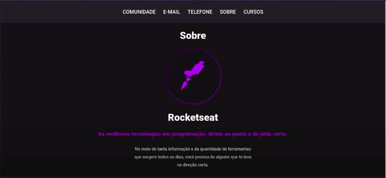

# README

# Rocketseat Website

[https://youtu.be/8Q5nGHsaGv8](https://youtu.be/8Q5nGHsaGv8)

## 🚀 Tecnologias

Esse projeto foi desenvolvido com as seguintes tecnologias:

- [HTML](https://www.w3schools.com/html/default.asp)
- [CSS](https://www.w3schools.com/css/default.asp)
- [Javascript](https://www.w3schools.com/js/default.asp)
- [Node.js](https://nodejs.org/en/)
- [Express](https://expressjs.com/pt-br/)
- [Nunjucks](https://mozilla.github.io/nunjucks/)

## 💻 Projeto

Este projeto é um site fictício para a empresa Rocketseat.

## 🤔 Como contribuir

- Faça um fork desse repositório;
- Cria uma branch com a sua feature: `git checkout -b minha-feature`;
- Faça commit das suas alterações: `git commit -m 'feat: Minha nova feature'`;
- Faça push para a sua branch: `git push origin minha-feature`.

Depois que o merge da sua pull request for feito, você pode deletar a sua branch.

---

Feito com ♥ by Samuel Cabral :wave: Meu Linkedin: [samuel-cabral](https://linkedin.com/in/samuel-cabral)